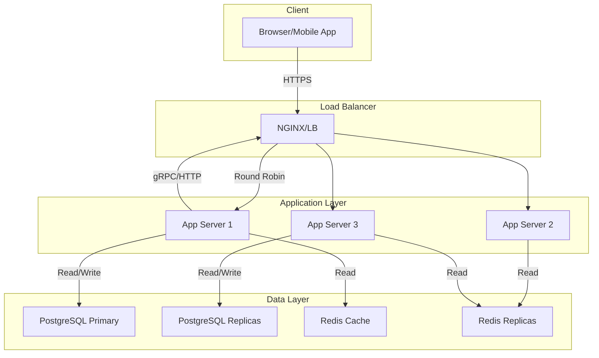

# URL Shortener - System Design

## Overview

A highly scalable, distributed URL shortener service designed for high availability and performance. This system demonstrates core system design principles including sharding, caching, and horizontal scaling.

## Architecture



## Core Design Decisions

### 1. URL Shortening Algorithm
- **Base62 Encoding**: Short codes use [a-zA-Z0-9] = 62 characters
- **6-character codes**: 62^6 = 56,800,235,584 possible URLs (~58 billion)
- **Collision handling**: Retry with incremental code generation

### 2. Data Storage
- **Primary Database**: PostgreSQL with Prisma ORM
- **Cache Layer**: Redis for O(1) lookups
- **Schema**:
  - `users`: id, email (unique), name, createdAt
  - `urls`: id, url, shortCode (unique), createdAt, isActive, deletedAt, userId

### 3. Request Flow

**Shorten URL**:
```
Client --> LB --> App Service --> Validate URL --> Generate shortCode --> Save to DB --> Return short URL
                                              |
                                              v
                                      Redis SET shortCode -> originalURL
```

**Redirect**:
```
Client --> LB --> App Service --> Redis GET shortCode --> ?
    |-- Hit: 301 Redirect to original URL
    |-- Miss: PostgreSQL SELECT url WHERE shortCode = ? --> Cache update --> 301 Redirect
```

## Capacity & Load Estimates

### Traffic Scenarios

| Metric | Value | Assumptions |
|--------|-------|-------------|
| **Daily shortenings** | 10M URLs/day | Medium-scale service |
| **Monthly active users** | 2M users | Average 5 URLs/user |
| **Read/write ratio** | 100:1 | Mostly redirects vs. new creations |
| **Peak QPS (writes)** | 116 writes/sec | 10M / 86,400 sec |
| **Peak QPS (reads)** | 11,600 reads/sec | 100× write traffic |
| **Storage per URL** | ~200 bytes | Original URL + metadata |
| **Monthly storage** | 200GB | 10M URLs × 200 bytes |

### Cache Performance

| Metric | Target | Approach |
|--------|--------|----------|
| **Cache hit ratio** | >95% | Pre-warm hot URLs, LRU eviction |
| **Redis TTL** | 30 days default | Auto-expire inactive URLs |
| **Memory requirement** | ~2GB for 58B codes | 58B × 35 bytes ≈ 2GB |

### Scaling Limits

| Component | Max Capacity | Notes |
|-----------|--------------|-------|
| **Short codes** | ~58 billion (6 chars) | Base62, sufficient for most services |
| **PostgreSQL connections** | 500-1000 max | Use connection pooling (PgBouncer) |
| **Redis QPS** | ~100K ops/sec | Depends on instance size |
| **Bandwidth** | 100Mbps sustained | Assumes avg. redirect 2KB |

## API Endpoints

| Method | Endpoint | Description | Auth |
|--------|----------|-------------|------|
| `POST /api/v1/shorten` | Create short URL | Generate short code for long URL | Optional |
| `GET /:shortCode` | Redirect | Permanent redirect to original URL | None |
| `GET /api/v1/urls` | List user URLs | Get all URLs for authenticated user | Required |
| `DELETE /api/v1/urls/:id` | Delete URL | Soft delete by marking inactive | Required |

## Database Schema (Prisma)

```prisma
model User {
  id        String   @id @default(uuid())
  email     String   @unique
  name      String?
  createdAt DateTime @default(now())
  urls      Url[]
}

model Url {
  id        String   @id @default(uuid())
  url       String   // Original long URL
  shortCode String   @unique // Base62 encoded
  createdAt DateTime @default(now())
  isActive  Boolean  @default(true)
  deletedAt DateTime?
  userId    String   // Foreign key to User
  user      User     @relation(fields: [userId], references: [id])
}
```

## Key Design Patterns

### 1. Idempotency
- `Idempotency-Key` header for repeat shortenings
- Prevents duplicate URL entries

### 2. Rate Limiting
- **Per-user**: 100 shortenings/minute
- **Global**: 1000 shortenings/minute
- Sliding window counter in Redis

### 3. URL Validation
- Protocol validation (http/https)
- Domain whitelist/blacklist
- Maximum URL length: 2048 characters

### 4. Expiration & Cleanup
- Optional TTL on shortened URLs
- Background job to purge expired entries
- Redis key expiration + PostgreSQL soft delete

## Technology Stack

| Layer | Technology | Rationale |
|-------|-----------|-----------|
| Framework | NestJS 11 | Type-safe, modular, built-in IOC |
| Language | TypeScript | Type safety across stack |
| Database | PostgreSQL + Prisma | ACID guarantees, complex queries |
| Cache | Redis (ioredis) | Sub-millisecond lookups |
| Encoding | Base62 | Compact, URL-safe codes |
| Validation | class-validator | Declarative DTO validation |
| Auth | @nestjs/jwt | Standard OAuth2/JWT flow |

## Monitoring & Observability

- **Metrics**: Prometheus counters for requests, cache hit/miss, error rates
- **Tracing**: OpenTelemetry for request flow tracking
- **Logs**: Structured JSON logs via Winston
- **Health checks**: `/health` endpoint for LB integration

## Deployment

### Local Development
```bash
# 1. Install dependencies
npm install

# 2. Set up environment
cp .env.example .env
# Configure DATABASE_URL, REDIS_URL

# 3. Database setup
npx prisma migrate dev --name init

# 4. Start services
docker compose up -d  # starts PostgreSQL + Redis
npm run start:dev
```

### Production Considerations
- **Horizontal scaling**: Stateless app servers behind LB
- **Database**: PostgreSQL with read replicas
- **Cache**: Redis cluster with replication
- **CDN**: Serve static assets, cache redirect responses
- **Feature flags**: Launch new URL shortener v2 gradually

## Benchmarks

| Metric | Measured | Target |
|--------|----------|--------|
| **Shorten latency** | ~50ms p95 | <100ms |
| **Redirect latency** | ~10ms p95 (cache hit), ~40ms p95 (DB miss) | <50ms cache hit |
| **Cache miss rate** | ~5% with 100:1 read:write | <10% |
| **Availability** | 99.9% target | >99.5% |
| **Throughput** | 10K writes/sec sustained | 100K writes/sec with sharding |